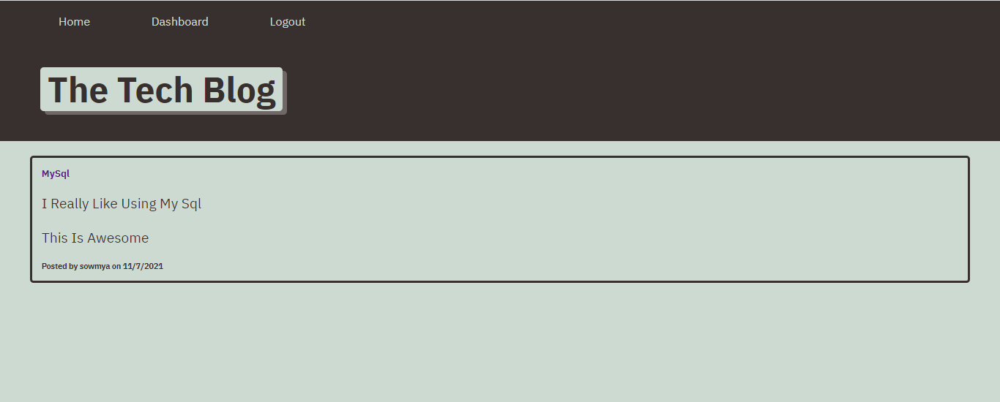

# Homework 14: Tech-Blog

## License

The Project is licensed under the MIT License
MIT License
Copyright (c) 2021 SowmyaNagayya

Permission is hereby granted, free of charge, to any person obtaining a copy
of this software and associated documentation files (the "Software"), to deal
in the Software without restriction, including without limitation the rights
to use, copy, modify, merge, publish, distribute, sublicense, and/or sell
copies of the Software, and to permit persons to whom the Software is
furnished to do so, subject to the following conditions:

The above copyright notice and this permission notice shall be included in all
copies or substantial portions of the Software.

THE SOFTWARE IS PROVIDED "AS IS", WITHOUT WARRANTY OF ANY KIND, EXPRESS OR
IMPLIED, INCLUDING BUT NOT LIMITED TO THE WARRANTIES OF MERCHANTABILITY,
FITNESS FOR A PARTICULAR PURPOSE AND NONINFRINGEMENT. IN NO EVENT SHALL THE
AUTHORS OR COPYRIGHT HOLDERS BE LIABLE FOR ANY CLAIM, DAMAGES OR OTHER
LIABILITY, WHETHER IN AN ACTION OF CONTRACT, TORT OR OTHERWISE, ARISING FROM,
OUT OF OR IN CONNECTION WITH THE SOFTWARE OR THE USE OR OTHER DEALINGS IN THE
SOFTWARE.;

## objectives

I have created a Tech Blog that facilitates communication between developers. In the dashboard users can see all blog posts and comments. Once signed up and logged in users can comment on blog post, create, update, and delete their posts.

## Table of Contents

- [Installation instructions](#installationinstructions)
- [License](#license)
- [question](#Questions)

## Installation instructions

First, download or clone the repository to your local machine. Then, from within the root directory, run:

npm i
to install all the necessary dependencies.

Next, you will need to connect the application to a MySQL database running locally on your machine. First, make sure you have a MySQL server installed and running on your machine. After confirming you have a server runnning, you will need to create a .env file in the root directory to hold your database credentials. You will need to add the following three properties:

DB_USER=<username>
DB_PASSWORD=<password>
DB_NAME='techblog_db'
Once this is complete, you will need to instantiate the database via the provided schema.sql file. From your root directory, run:

mysql -u <username> -p

and enter your username and password credentials. Then, from inside your MySQL shell, run:

source db/schema.sql // creates the database, or recreates if it already exists.
quit
Optionally, you may seed the database with provided dummy data contained in the /seeds directory by running:

The application should now be ready for use.

## Screenshot of homepage

## Link to deployed page

You can also refer to this [Heroku](https://sowmyatech-blog.herokuapp.com/).

## Questions

Please email any questions to kkd.sowmya@gmail.com or reference my [GitHub profile](https://github.com/SowmyaNagayya).
